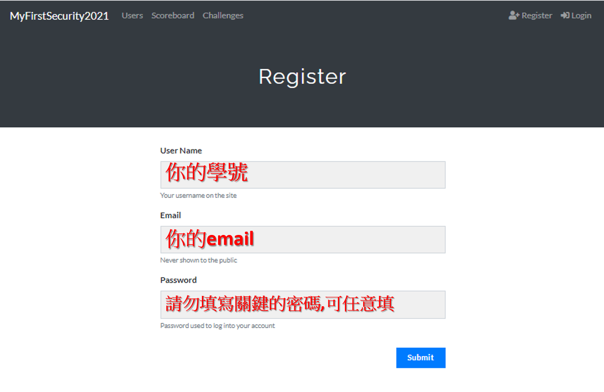

# 1.透過參與CTF搶旗大賽學習資安實務	[YOUYUBE錄影](https://youtu.be/65ssViH3rd0)

## CTF(Capture The Flag)搶旗大賽
- [令人感動一定要看的影片HITCON in DEFCON 22 CTF Final 紀錄片](https://www.youtube.com/watch?v=XcneHvq1hbY)
  - 你可以看到許多`台灣好厲駭`導師的年輕身影 
- [一次看懂CTF資安攻防賽](https://www.ithome.com.tw/news/102969) 
  - 三大主要CTF資安攻防賽類型
    - 1_解謎式（Jeopardy） 本次教學使用的類型
    - 2_攻防模式（Attack and Defense）
    - 3_King of The Hill(類似搶灘遊戲)
- [ddaa (0xddaa)寫的CTF 的三十道陰影 系列](https://ithelp.ithome.com.tw/users/20121059/ironman/2810)

## 註冊與登入CTF

- 登入CTF平台(上課使用的平台)
- 註冊(register) ==> 點選右上角register按鈕

## 起手式---word隱寫術

## 台灣舉辦的世界級搶旗大賽Hitcon CTF

- [HITCON YOUTUBE頻道的影片](https://www.youtube.com/c/HacksInTaiwan/videos)
- [讓我們解題Hitcon CTF吧](https://ctf2017.hitcon.org/)  

## 更多台灣舉辦的ctf(以字母順序陳列+請上網搜尋)  若有遺漏煩請告知! 謝謝
- AIS3 CTF
- AIS3 EOF CTF
- [Balsn CTF](https://balsn.tw/)
- BambooFox CTF
- [MyFirstCTF](https://ais3.org/mfctf/)

## 更多國外cctf資訊==> [CTFtime](https://ctftime.org/)
