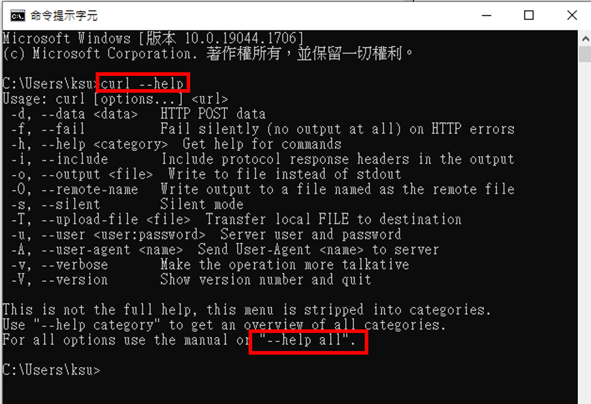

# 2_網站安全測試 [YOUYUBE錄影](https://youtu.be/n9S-th78_9E)
- 透過簡單的網站安全解題讓學員啟動網站安全測試的興趣

## Web101解題
## Web-1:source code 隱藏在註解裡的FLAG
## web-2: Easy_Robots.txt == >Robot.txt的奧秘
- [Robots.txt - 維基百科](https://zh.wikipedia.org/zh-tw/Robots.txt)
- robots.txt是一種文字檔案，它告訴網路搜尋引擎此網站中的哪些內容是不應被搜尋引擎的搜尋到的，哪些是可以被搜尋引擎搜尋到的。
- robots.txt放在網站伺服器的哪個位置?

## web-3:Robots.txt [學完課程3_編碼與解碼後再來解這題]
- 仔細看提示HINT
- 本題任務是請你找到robots.txt並因此找到flag。
- 提示1 : robots.txt的存放放置
- 提示2 : 相關hex to string及base64 編碼


# 底下兩題是規劃讓學生熟悉curl工具
- [官方網址](https://curl.se/)
- [官方提供的書 Everything curl ](https://curl.se/book.html)
- curl的windows版
  - windows 10以上已經支援
  - [其他版本則需到官方網址下載](https://curl.se/download.html)




- [使用 Curl 來進行發送 HTTP Request封包](https://blog.techbridge.cc/2019/02/01/linux-curl-command-tutorial/)

| 參數 | | 說明 |
| -- | -- | --|
|-X |--request  | 可以加的參數GET,POST,PUT,DELETE,PATCH:使用指定的 http method 來發出 http request| 
| -H | --header    |                        設定 request 裡所攜帶的 header| 
| -i| --include   |                        在 output 顯示 response 的 header| 
| -d| --data       |                       攜帶 HTTP POST Data | 
| -v| --verbose     |                      輸出更多的訊息方便 debug| 
| -u| --user       |                       攜帶使用者帳號、密碼| 
| -b| --cookie      |                      攜帶 cookie（可以是參數或是檔案位置）| 


## web-4:Curl-1 ==> url redirection的破招 [解答影片]()

## web-5:HTTP method ==>HTML method的奧義[解答影片]()

```
curl -X GET -v http://ip:3001/index.php

curl -v http://ip:3001/index.php

curl -X POST -v http://ip:3001/index.php

curl -X OPTIONS  -v http://ip:3001/index.php

curl -X GETFLAG  -v http://ip:3001/index.php
```


## 網站伺服器(web server)與網站應用程式(Web application)
