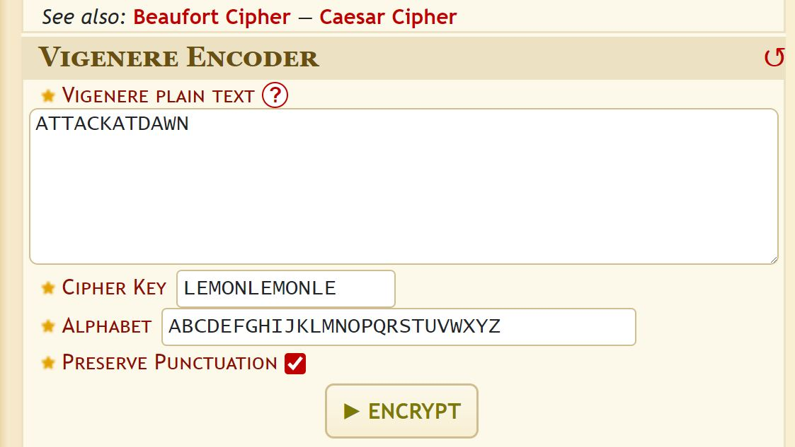
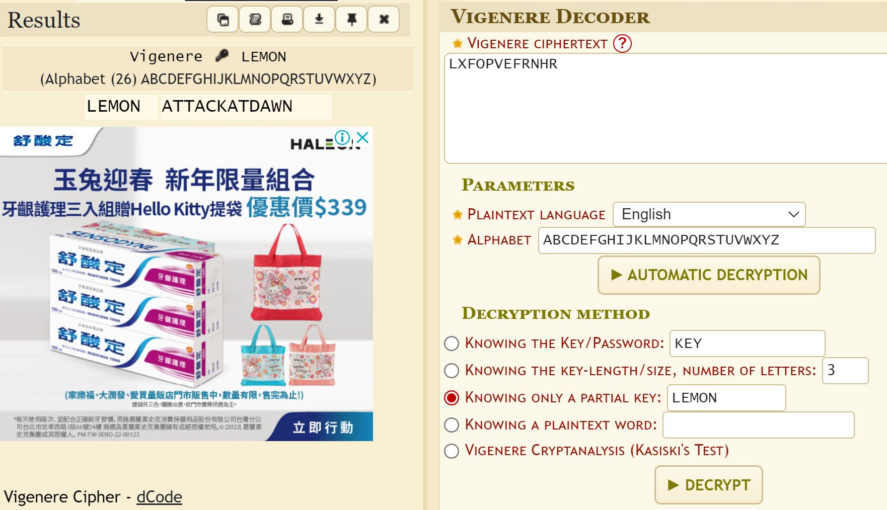
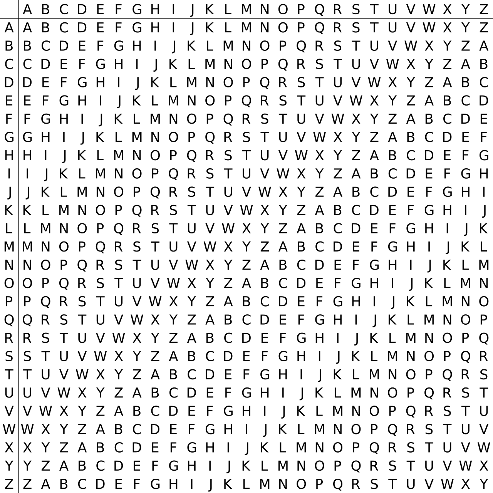

# [Vigenère cipher 維吉尼亞密碼](https://en.wikipedia.org/wiki/Vigen%C3%A8re_cipher)

```
明文(plaintext):ATTACKATDAWN
keyword "LEMON"
加密後的密文(ciphertext )為何 ?
```
# 明文:ATTACKATDAWN

# 金鑰:LEMONLEMONLE

# 密文:LXF0PVEFRNHR

## 使用[線上工具](https://www.dcode.fr/vigenere-cipher)
## 加密

## 解密




