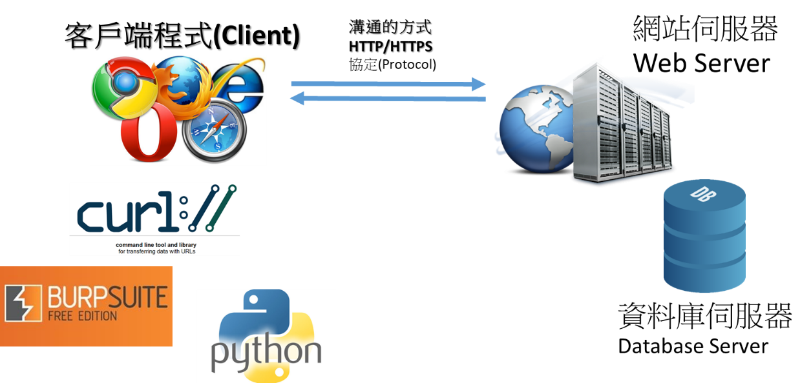
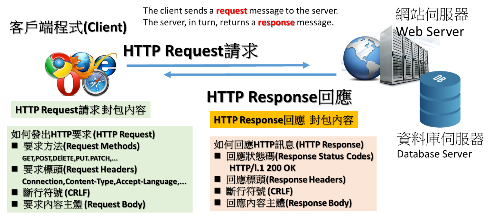

# web-5:HTTP method ==>HTTP method的奧義
# curl工具
- [官方網址](https://curl.se/)
- [官方提供的書 Everything curl ](https://curl.se/book.html)
- curl的windows版
  - windows 10以上已經支援
  - [其他版本則需到官方網址下載](https://curl.se/download.html)

# [HTTP(Hypertext Transfer Protocol)](https://en.wikipedia.org/wiki/Hypertext_Transfer_Protocol)




# HTTP method
- [Http Method(Http方法)介紹 和 跨來源資源共用（CORS）](https://hackmd.io/@Not/rJoRFJa3S)
- [HTTP request methods](https://developer.mozilla.org/en-US/docs/Web/HTTP/Methods)

- [使用 Curl 來進行發送 HTTP Request封包](https://blog.techbridge.cc/2019/02/01/linux-curl-command-tutorial/)

| 參數 | | 說明 |
| -- | -- | --|
|-X |--request  | 可以加的參數GET,POST,PUT,DELETE,PATCH:使用指定的 http method 來發出 http request| 
| -H | --header    |                        設定 request 裡所攜帶的 header| 
| -i| --include   |                        在 output 顯示 response 的 header| 
| -d| --data       |                       攜帶 HTTP POST Data | 
| -v| --verbose     |                      輸出更多的訊息方便 debug| 
| -u| --user       |                       攜帶使用者帳號、密碼| 
| -b| --cookie      |                      攜帶 cookie（可以是參數或是檔案位置）| 
# 測試步驟
```
curl -X GET -v http://ip:3001/index.php

curl -v http://ip:3001/index.php

curl -X POST -v http://ip:3001/index.php

curl -X HEAD http://120.114.62.215:3001/index.php

curl -I HEAD http://120.114.62.215:3001/index.php

curl -X OPTIONS  -v http://ip:3001/index.php

curl -X GETFLAG  -v http://ip:3001/index.php
```
