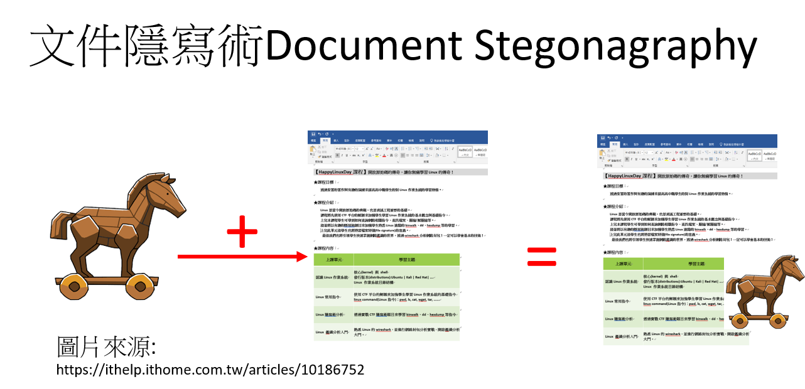

# 1_認識隱寫術 Steganography
- [隱寫術--wiki說明](https://zh.wikipedia.org/wiki/隱寫術)
```
隱寫術是一門關於資訊隱藏的技巧與科學

資訊隱藏(data hiding)指的是不讓除預期的接收者之外的任何人知曉資訊的傳遞事件或者資訊的內容。

隱寫術的英文叫做Steganography，來源於特裡特米烏斯的一本講述密碼學與隱寫術的著作Steganographia，
該書書名源於希臘語，意為「隱秘書寫」
```




# 各種類型的隱寫術
```
Document Stegonagraphy:各種文件類型的隱寫術[壞蛋行為: 在word, pdf 等文件 隱藏 惡意程式(木馬...)]

Image Stegonagraphy:隱藏在圖片的機密[壞蛋行為:在png, jpg 等 圖片 隱藏 惡意程式(木馬...)]

Audio Stegonagraphy:隱藏在聲音的機密[壞蛋行為:在MP3, wav 等 聲音檔案 隱藏 惡意程式(木馬...)]

Video Stegonagraphy:隱藏在影片的機密[壞蛋行為:在MP4 等 影像檔案 隱藏 惡意程式(木馬...)]

所以不要隨便下載咚咚!危險!
```
# [`Stego`malware(Steganography Malware)](https://en.wikipedia.org/wiki/Stegomalware) 
- 使用隱寫術來阻礙`資安偵測`的惡意軟體
- [ithome報導(2021-04-22) 文/周峻佑 | 2021-04-22](https://www.ithome.com.tw/news/143981)
```
藏匿惡意程式的手法越來越繁複！北韓駭客Lazarus濫用BMP圖檔及內嵌壓縮檔案，並搭配圖檔格式轉換等多重手法，來藏匿木馬程式

駭客運用圖片來隱藏攻擊工具的現象，可說是時有所聞，但許多是針對網站側錄（Web Skimming）而來。
而最近，北韓駭客組織Lazarus將這種手法運用於散布木馬程式上，他們透過BMP圖檔與反覆的呼叫手法，來偷渡惡意程式，
進而在受害電腦上竊密
```
- [圖像隱碼術(Steganography)與惡意程式：原理和方法](https://blog.trendmicro.com.tw/?p=12510)
- [How Steganography Allows Attackers to Evade Detection](https://www.esecurityplanet.com/threats/how-steganography-allows-attackers-to-evade-detection/)

# [`歐洲刑警組織支持的CUING倡議(The Europol-supported CUING initiative)`](https://cuing.eu/)持續監控 隱寫術在惡意軟體中的使用狀況

# 動手隱藏八~~ 隱寫術(Steganography)實戰  [Steganography Online](https://stylesuxx.github.io/steganography/)
- [從網路上下載的貓](./cat.jpg)
- [請你找出隱寫貓的Flag](./mycat.png)

# 本課程 是 讓 學生 理解 如何進行 基礎隱寫術 的 簡易[Steganalysis](https://en.wikipedia.org/wiki/Steganalysis)分析

# python Image Steganography and Python Steganalysis(以後有時間八)
  - 測看看吧[Stegano, a pure Python Steganography module.](https://pypi.org/project/stegano/)
  - [教學影片Hide Text in Image with Python - Stegano](https://www.youtube.com/watch?v=IhXbJfLCst0)
## 有興趣還可以看看[人工智慧隱寫術 steganogan(看不懂不要問我,我也不會)](https://github.com/DAI-Lab/SteganoGAN)
- An open source project from Data to AI Lab at MIT.
- [2019年 MIT 論文SteganoGAN: High Capacity Image Steganography with GANs](https://arxiv.org/abs/1901.03892#:~:text=Image%20steganography%20is%20a%20procedure,presence%20of%20the%20message%20itself.)
- [英文手冊](https://stegano.readthedocs.io/en/latest/) 

## (看不懂不要問我,我也不會)系列之2: 
- Google研究人員的論文 [Hiding Images in Plain Sight: Deep Steganography](https://dl.acm.org/doi/pdf/10.5555/3294771.3294968) 
- [待測試的實作:Hiding Images In plain sight: Deep Steganography]() [YOUTUBE影片](https://www.youtube.com/watch?v=8Rcr7_Khldk)


