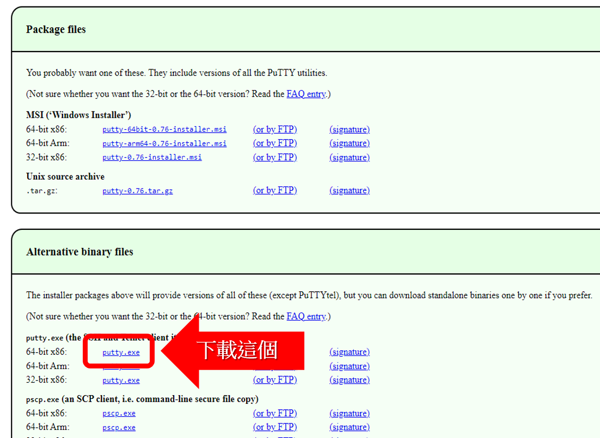
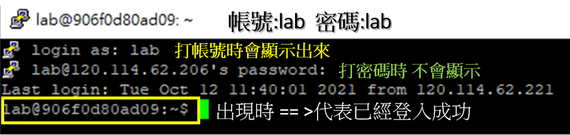

## 2.Linux基本指令

- 檔案與目錄操作指令
- redirection(重定向)與pipe(管道)
- Linux網路指令
- 學習資源:
  - Linux 有許多指令學習主要使用方法 有需要時上網查
  - [The 40 Most-Used Linux Commands You Should Know](https://kinsta.com/blog/linux-commands/#:~:text=A%20Linux%20command%20is%20a,abstraction%20of%20command%2Dline%20programs.)
  - [Linux Command 命令列指令與基本操作入門教學](https://blog.techbridge.cc/2017/12/23/linux-commnd-line-tutorial/)
  - [Linux 命令大全](https://www.runoob.com/linux/linux-command-manual.html)

## lab實作:目錄存取常用指令(linux command)
- pwd ==>  顯示目前的工作目錄位置(Print Working Directory)
- cd ==> 用來變換工作目錄的指令(Change Directory)
  - cd ==> 回到使用者目錄
  - cd .. ==> 回到上層目錄
  - cd /bin ==> 切竄到/bin 目錄
- ls ==> 列出目前目錄中的檔案與目錄列表
- cat ==> (1)印出檔案內容 (2)合併多檔(concatenate）
  - cat flag
  - cat /etc/passwd
```
試輸入底下指令與參數 看看結果有何不同
ls
ls -l   <== 注意:有空格  顯示檔案與目錄的詳細資訊
ls -a    <== 注意:大小寫有區別(Case-sensitive) -a 參數可以顯示隱藏的檔案與目錄
ls -A

可以把兩個參數合在一起
ls -Al

梗多說明請參看
https://blog.gtwang.org/linux/linux-ls-command-tutorial/
```
## 指令語法與參數
```
pwd 的語法:  pwd [OPTION]

參數[OPTION]：
-L 如果當前目錄為連結檔, 會顯示連結檔名稱。
-P: 如果當前目錄為連結檔, 不會以連結檔的路徑來顯示, 會顯示實際的目錄位置。
–help: 顯示幫忙訊息。
–version: 顯示 pwd 版本。
```
## 查閱指令參數小撇步
```
1.直接在terminal 查 
    ls -h
    ls --h
    ls -help
    ls --help
    
2.上網google ==> linux ls

3.man ls
```
## Linux重要的redirection(重定向)與 pipe(管道)功能

- pipe(管道)
  - cat /etc/passwd | less

- redirection(重定向)
  - 輸出重定向(Output redirection)  ==> ls -al > ls.txt

## 後續研讀 Linux shell programming

# 開始連線到LINUX ctf 去解題吧!
## 遠端連線到CTF伺服器
- 有許多遠端連線工具,本課程使用putty [讓你體驗被踢出來的感覺]
- 下載putty
  - [putty下載點](https://www.chiark.greenend.org.uk/~sgtatham/putty/latest.html)
  - 下載putty的版本
  
- 解壓縮後即可使用
- 使用putty 登入時的畫面



- [Linux-101解答](https://github.com/MyFirstSecurity2020/SecurityFoscusOnline2023/blob/main/A2_Linux%E8%B3%87%E5%AE%89%E6%8A%80%E8%A1%93%E5%85%A5%E9%96%80/2_1_Linux101%E8%A7%A3%E7%AD%94.md)
- [Linux-102解答](https://github.com/MyFirstSecurity2020/SecurityFoscusOnline2023/blob/main/A2_Linux%E8%B3%87%E5%AE%89%E6%8A%80%E8%A1%93%E5%85%A5%E9%96%80/2_2_Linux%20102%E8%A7%A3%E7%AD%94.md)
- Linux-103(測驗用,請勿公布解答到網路上)
- 作業1:完成底下[linux練習](https://overthewire.org/wargames/bandit/)
- 作業2:第二階段學 [ 找書學或上網找資料 ==> 整理到你的GITHUB]
```
linux檔案處理指令  cp rm chmod...
linux檔案壓縮與打包指令 zip tar uzip ...
linux系統管理指令  ps top ...
Linux記憶體臉管理指令 free ...
linux使用者管理指令  useradd userdel passwd
Linux網路指令 wget ssh ...
...
```
