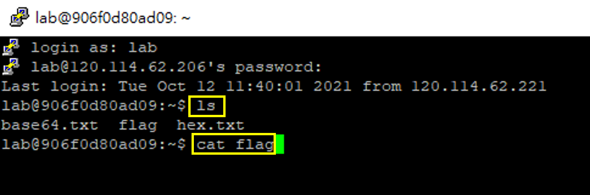
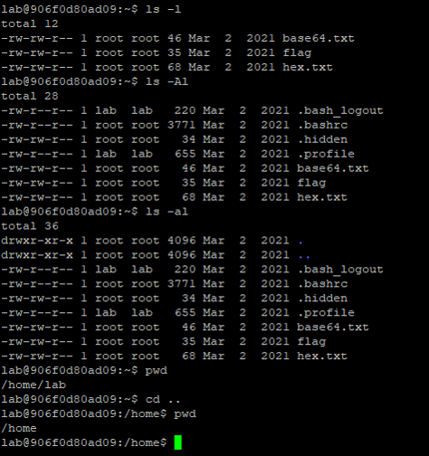
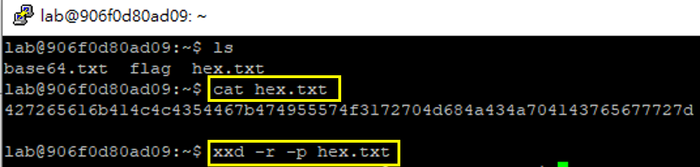
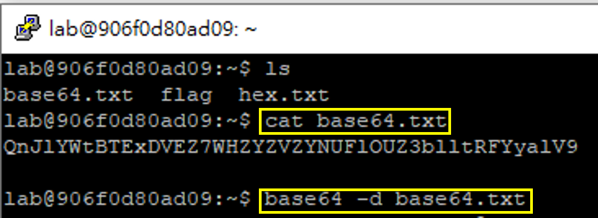
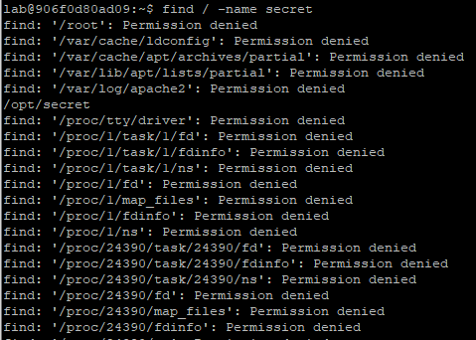

### linux-1:指令

- 解答
  - ls 
  - cat flag

### linux-2:指令參數的用法

- 解答
  - ls -Al
  - cat .hidden
   
- 說明清楚底下指令參數的結果
  - ls -l
  - ls -A
  - ls -a
  - ls -Al 

### linux-3:16進位轉字串(hex to string) ==>就是ascii編碼==> LINUX指令:xxd

### linux-4:base64 解碼==> LINUX指令: base64

### linux-5:找尋檔案的LINUX指令:find

.png)

