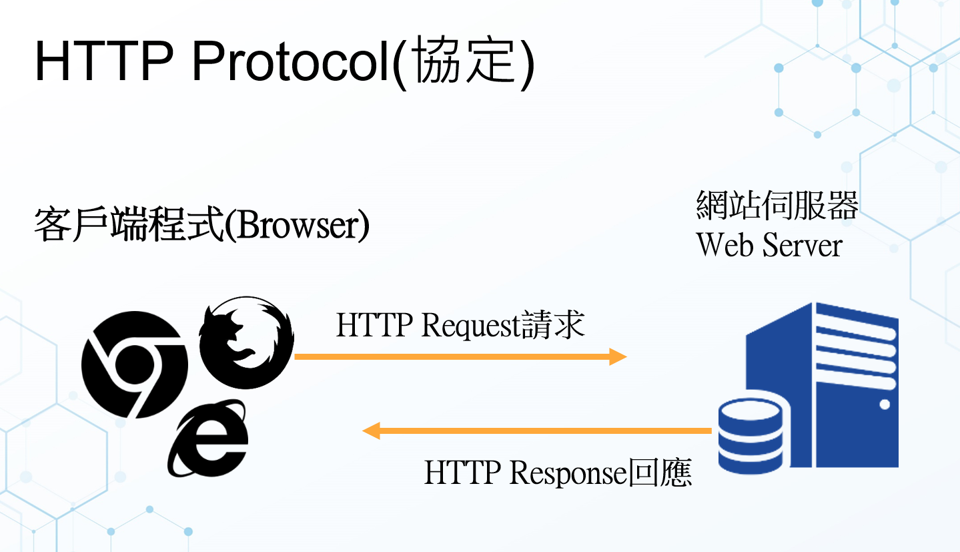

- HTTP `Request`(HTTP client[瀏覽器或其他工具如CURL] 送出的`請求`封包)
  - [請求方法(Request Methods):常見的有：GET ,POST, HEAD,OPTIONS,…](https://zh.wikipedia.org/wiki/超文本傳輸協議#請求方法)

- HTTP `Response` (伺服器`回應`封包)
  - Status Code(狀態碼)
