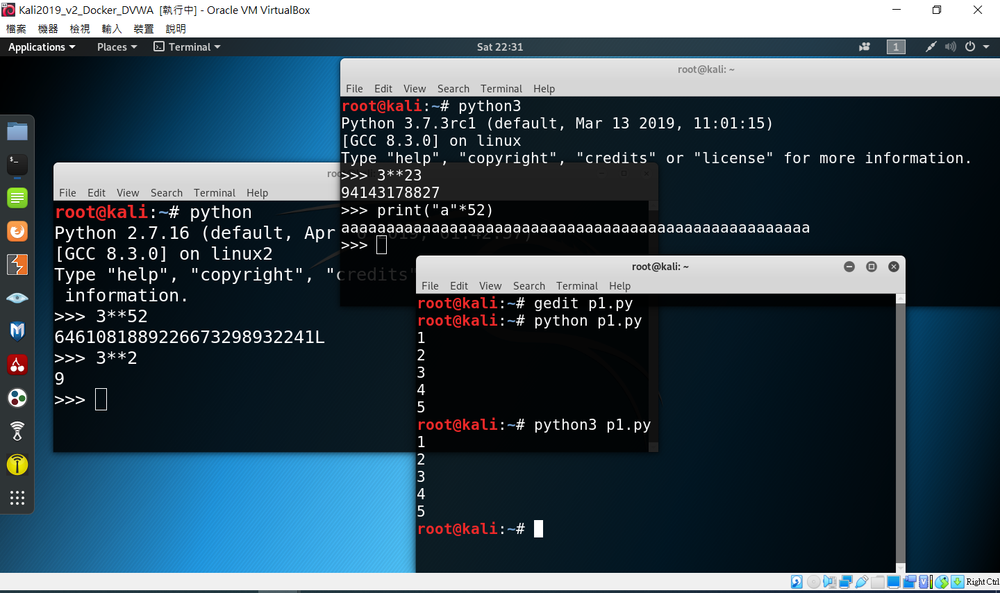

# python開發環境 [錄影教學影片YOUTUBE](https://youtu.be/4iyU3XKhz7Q)
```
python有許多開發環境與IDE(Pycharm, spyder,visual studio code,...)

本課程將使用底下兩種
[1]linux python程式開發(使用最簡單的gedit撰寫程式)
[2]使用Goolge Colab 平台開發python程式

其他請參閱Google或書籍
   如Windows python程式開發
```
# [1]linux python程式開發



## linux python程式開發(1)互動式模式
### python3[持續發展中, 學習python的重心]
```
打開terminal ==> 輸入python3
     ===> 開始python3互動式 開發
     
root@kali:~# python3 <==輸入python3
Python 3.7.3rc1 (default, Mar 13 2019, 11:01:15) 
[GCC 8.3.0] on linux
Type "help", "copyright", "credits" or "license" for more information.


>>> print("Hello, World!")   <== 輸入簡單的程式
Hello, World!

>>> exit() <== 離開互動式模式
```
### python2[已經不再更新, 但仍有些套件使用]
```
打開terminal ==> 輸入python
     ===> 開始python2互動式 開發

oot@kali:~# python  <==輸入python
Python 2.7.16 (default, Apr  6 2019, 01:42:57) 
[GCC 8.3.0] on linux2
Type "help", "copyright", "credits" or "license" for more information.

>>> print("Hello, World!")    <== 輸入簡單的程式
Hello, World!

>>> exit()   <== 離開互動式模式
```
## linux python程式開發(2)標準模式
```
使用最簡單的gedit 撰寫程式 ==> gedit XXX.py
執行程式 ==> python3 XXX.py
```
### 範例

使用最簡單的gedit 撰寫程式 ==> gedit test.py
```
# 先不用解釋程式 後面會教
i = 1

while i < 6:
  print(i)
  i += 1
```
執行程式 ==> python3 XXX.py
```
python3 test.py

#若是要執行python2程式 則執行python test.py
```
# [2]使用Goolge Colab 平台開發python程式
```
請課後 再看
Colab 的簡介影片 ==>https://www.youtube.com/watch?v=inN8seMm7UI
```


## 開始動手
```
Google 搜尋 Google Colab ==> 即可找到連結
  ==> 點選連結 需先登入(建議使用Google 帳號登入)
  ==> 出現選擇 檔案來源畫面 時 先按取消
```
### 範例:查看重要 Google Colab已安裝的重要套件版本[先不要解釋內容]
```
將底下程式碼貼到cell
ctrl + Enter 即可執行
```
```
import pandas as pd
print("pandas version: %s" % pd.__version__)
 
import matplotlib
print("matplotlib version: %s" % matplotlib.__version__)
 
import numpy as np
print("numpy version: %s" % np.__version__)
 
import sklearn
print("scikit-learn version: %s" % sklearn.__version__)
 
import tensorflow as tf
print("tensorflow version: %s" % tf.__version__)
 
import torch
print("PyTorch version: %s" %torch.__version__)
print("2021年4月PyTorch version最新版本 請參閱https://pytorch.org/")
```
### 範例:已安裝的pyhon套件與版本[要有 驚嘆號 !]
```
!pip list
```
##
```
!gcc --help

!g++ --help
```
### 作業
```
上網google pip的各種作法
https://pip.pypa.io/en/stable/
```
### 上網看看下列主題
```
將在Google Colab執行的程式存到你自己的 Github 
打開Google Drive(雲端硬碟) 檢視你開發的python程式(XXX.ipynb)
下載 在Google Colab執行的程式(XXX.py格式) 
下載 在Google Colab執行的程式(XXX.ipynb格式) 
開啟別人在github上的XXX.ipynb程式
...
```
