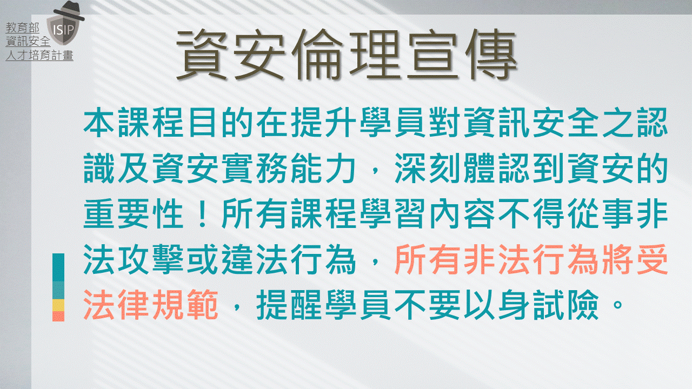

# SecurityFoscusOnline2023 上課資訊
- 2023年第八次課程(2023年|5月24日(星期三)-5月28日 (星期日)) 
  - [點此連結開始學習](https://github.com/MyFirstSecurity2020/SecurityFoscusOnline2023/blob/8c7e5b89b14c42c1cd1e85099be5a5105b0ca2e3/20230524.md)
  - [點此連結開始學習](https://github.com/MyFirstSecurity2020/SecurityFoscusOnline2023/blob/8c7e5b89b14c42c1cd1e85099be5a5105b0ca2e3/20230524.md)
  - [點此連結開始學習](https://github.com/MyFirstSecurity2020/SecurityFoscusOnline2023/blob/8c7e5b89b14c42c1cd1e85099be5a5105b0ca2e3/20230524.md)
  - 5.24-25 請先自己先學習部分主題
  - 5.26 CTF平台開啟，可以開始解題啦!
  - 5.27 會有講師示範各類型主題的技術 歐
  - 本課程強調自主學習 所以4.8上課前一定要先自己(配合錄影教學)完成部分主題歐

# SecurityFoscusOnline2023 課程內容與教學影片
- 底下所有GITHUB線上教材及教學錄影都會持續開放並陸續增加內容 == >同學可以盡情學習~無分晝夜
  - [A1_MyFirstSecurity資安入門的第一堂課](https://github.com/MyFirstSecurity2020/20230301)
  - [A2_Linux資安技術入門](https://github.com/MyFirstSecurity2020/20230302)
  - [A3_Python程式與資安應用入門](https://github.com/MyFirstSecurity2020/SF2023A3)
- CTF平台及證書發放~限定於開課期間才會開放 歐
  

# SecurityFoscusOnline2023歷史資料
- 2023年第一次課程(2月4日-5日):完整課程
- 2023年第二次課程(2月11日-12日):完整課程 
- 2023年第三次課程(2月19日):新北 永平高中 Linux 強化班
- 2023年第四次課程(2023年3月1-5日 (星期三-星期日)) 
- 2023年第五次課程(2023年3月8-12日 (星期三-星期日)) 
- 2023年第六次課程(2023年4月5-9日 (星期三-星期日))
- 2023年第七次課程(2023年4月15、4月22日 (星期六-星期六))

# SecurityFoscusOnline2023課程模組
- 從CTF實戰學習資訊安全測試(2023年2月開始)
  - A1_MyFirstSecurity資安入門的第一堂課
  - A2_Linux資安技術入門
  - A3_Python程式與資安應用入門 
- 程式安全測試入門(預計2023年6月開始)
- Linux 雲端docker技術與資安應用入門(預計2023年10月開始)

# SecurityFoscusOnline2023課程推動模式與活動
- 模式一:周末資安行
  - 只要一個星期六與星期日完整上完A1-A3課程模組
  - 如果全部都沒學過兩天要完成~是有點硬
- 模式二:快樂學資安
  - 分開舉辦:兩個晚上(如星期二與四晚上3小時) + 一個星期六或日即可
  - A2_Linux資安技術入門~可以實體上課 

## 後續研讀建議
- 關注臉書活動公告|參與更多資安學習|持續強化你的資安戰鬥力
  - 每年暑假SUMMER CAMP 程式安全分析夏令營
  - 不定期舉辦的現代密碼破密分析課程 
  - 不定期舉辦的網站安全分析課程
- 參加`年度台灣好厲駭高階資安人才培訓活動`(每年7-8月徵選)

# 開場白
- 上課之前 一定要宣讀 [資安倫理宣言](資安宣言.gif)

- 適合高中職學生學習資安的好去處[【高中職生資安研習營】 別忘了 按讚 給我們鼓勵](https://zh-tw.facebook.com/pages/category/Community/高中職生資安研習營-455550404836569/)

